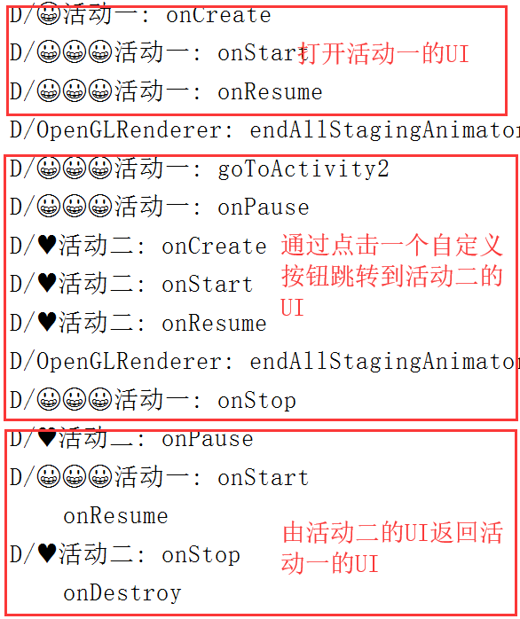
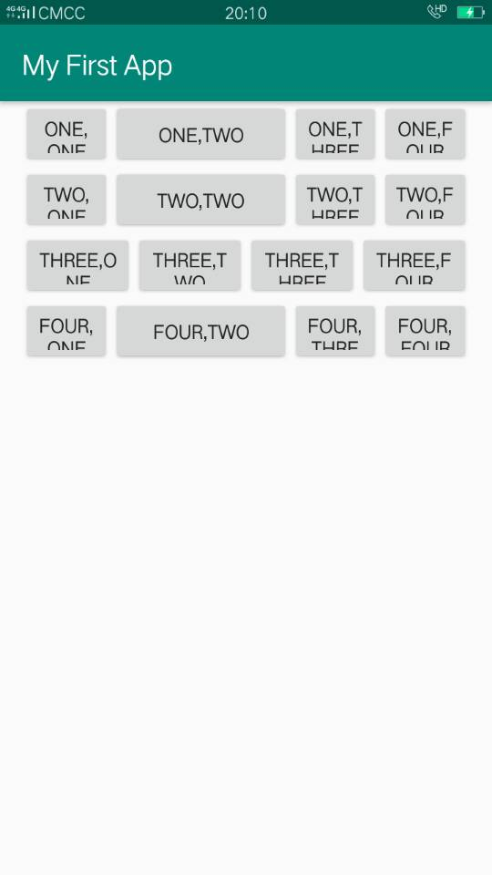
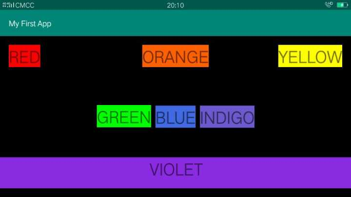
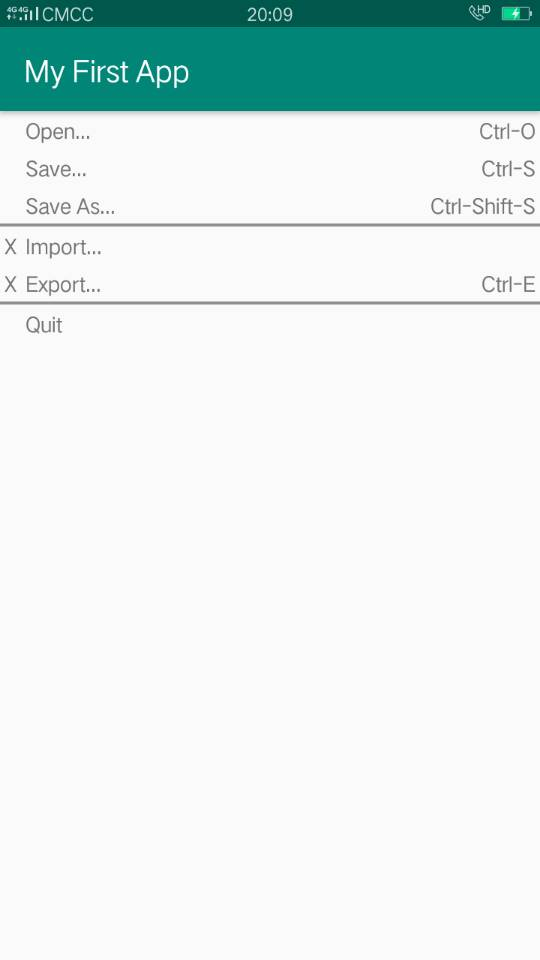

# android-hello-world

## 实验一_验证Activity的生命周期
### [一、代码地址](https://github.com/xkfx/android-hello-world/tree/master/app/src/main/java/com/example/myfirstapp/ex1)
### 二、简介与截图
1、定义两个可相互跳转的Activity类

2、Override父类中Activity生命周期相关的方法

3、通过Log.d打印日志到控制台实时观察方法的调用情况

## 实验二_Android布局实验

### 一、代码地址

代码地址见简介部分。

### 二、简介与截图

[1、LinearLayout](https://github.com/xkfx/android-hello-world/blob/master/app/src/main/res/layout/activity_linear_layout_test.xml)

[2、ConstraintLayout](https://github.com/xkfx/android-hello-world/blob/master/app/src/main/res/layout/activity_constraint_layout_test.xml)

[3、TableLayout](https://github.com/xkfx/android-hello-world/blob/master/app/src/main/res/layout/activity_table_layout_test.xml)

