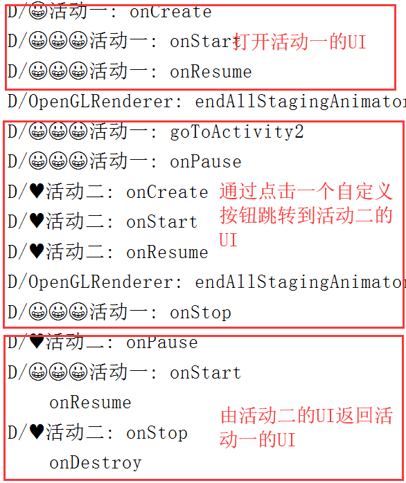

# 实验一_验证Activity的生命周期
## [一、代码地址](https://github.com/xkfx/android-hello-world/tree/master/app/src/main/java/com/example/myfirstapp/ex1)
## 二、简介与截图
1、定义两个可相互跳转的Activity类

2、Override父类中Activity生命周期相关的方法

3、通过Log.d打印日志到控制台实时观察方法的调用情况

