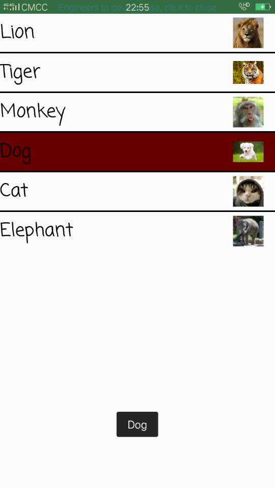
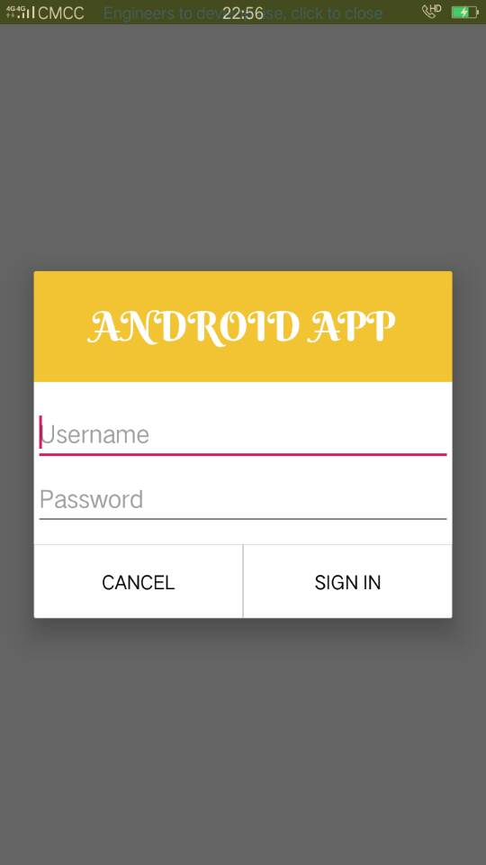
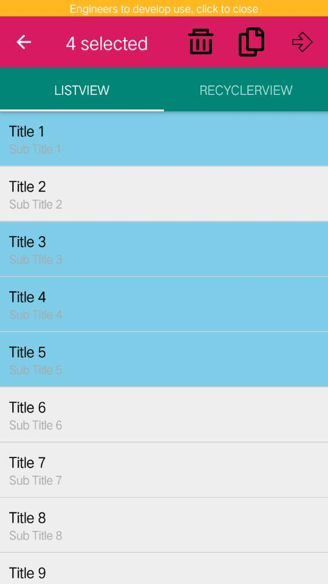

# 实验三_UI组件

## 一、代码地址

代码地址见简介部分。

相应布局文件地址（需要手动通过Ctrl+F找）：https://github.com/xkfx/android-hello-world/tree/master/app/src/main/res/layout

## 二、简介与截图

### [1、Android ListView的用法 ](https://github.com/xkfx/android-hello-world/blob/master/app/src/main/java/com/example/myfirstapp/ex3/ListViewSample.java)

### [2、创建自定义布局的AlertDialog ](https://github.com/xkfx/android-hello-world/blob/master/app/src/main/java/com/example/myfirstapp/ex3/AlertDialogSample.java)

### [3、使用XML定义菜单 ](https://github.com/xkfx/android-hello-world/blob/master/app/src/main/java/com/example/myfirstapp/ex3/MenuSample.java)

因为手机上没有菜单键，所以这里用的是popupMenu，设置对象是屏幕中心的按钮。

### [4、创建上下文操作模式(ActionMode)的上下文菜单](https://github.com/xkfx/android-hello-world/blob/master/app/src/main/java/com/example/myfirstapp/ex3/MenuSample.java)

参考自http://www.androhub.com/android-contextual-action-mode-over-toolbar/，长按任意一个item可以呼出ActionMode菜单，然后可以选中任意个item，并支持实际删除模拟数据。