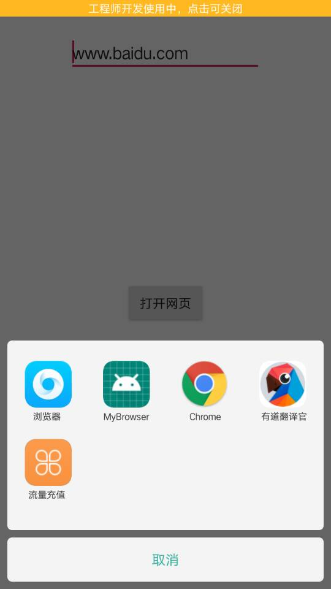

# 实验五_Intent 

## 一、代码地址

代码地址：https://github.com/xkfx/android-hello-world/blob/master/app/src/main/java/com/example/myfirstapp/ex5/LaunchBrowser.java


相应xml文件地址：https://github.com/xkfx/android-hello-world/blob/master/app/src/main/res/layout/ex5_launch_browser.xml


## 二、简介与截图

### 1、当前APP界面




### 2、自定义简易浏览器


com.example.mybrowser.MainActivity：

```java
package com.example.mybrowser;

import android.annotation.SuppressLint;
import android.os.Bundle;
import android.support.v7.app.AppCompatActivity;
import android.webkit.WebView;
import android.webkit.WebViewClient;

public class MainActivity extends AppCompatActivity {

    @SuppressLint("SetJavaScriptEnabled")
    @Override
    protected void onCreate(Bundle savedInstanceState) {
        super.onCreate(savedInstanceState);
        setContentView(R.layout.activity_main);

        WebView myWebView = findViewById(R.id.webview);
        myWebView.getSettings().setJavaScriptEnabled(true);
        myWebView.setWebViewClient(new WebViewClient(){
            // 防止跳转到系统默认浏览器
            @Override
            public boolean shouldOverrideUrlLoading(WebView view, String url) {
                view.loadUrl(url);
                return super.shouldOverrideUrlLoading(view, url);
            }
        });

        String url = getIntent().getDataString();
        if (url != null && !url.isEmpty()) {
            myWebView.loadUrl(url);
        } else {
            myWebView.loadUrl("http://www.baidu.com");
        }
    }
}


```


layout/activity_main.xml：

```xml
<?xml version="1.0" encoding="utf-8"?>
<android.support.constraint.ConstraintLayout xmlns:android="http://schemas.android.com/apk/res/android"
    xmlns:app="http://schemas.android.com/apk/res-auto"
    xmlns:tools="http://schemas.android.com/tools"
    android:layout_width="match_parent"
    android:layout_height="match_parent"
    tools:context=".MainActivity">

    <WebView
        android:id="@+id/webview"
        android:layout_width="match_parent"
        android:layout_height="match_parent"
        />

</android.support.constraint.ConstraintLayout>
```


app/src/main/AndroidManifest.xml：

```xml
<?xml version="1.0" encoding="utf-8"?>
<manifest xmlns:android="http://schemas.android.com/apk/res/android"
    package="com.example.mybrowser">
    <uses-permission android:name="android.permission.INTERNET" />

    <application
        android:allowBackup="true"
        android:icon="@mipmap/ic_launcher"
        android:label="@string/app_name"
        android:roundIcon="@mipmap/ic_launcher_round"
        android:supportsRtl="true"
        android:theme="@style/AppTheme">
        <activity android:name=".MainActivity">
            <intent-filter>
                <action android:name="android.intent.action.MAIN" />

                <category android:name="android.intent.category.LAUNCHER" />
            </intent-filter>

            <intent-filter>
                <action android:name="android.intent.action.VIEW" />
                <category android:name="android.intent.category.DEFAULT" />
                <category android:name="android.intent.category.BROWSABLE" />
                <data android:scheme="http" />
                <data android:scheme="https" />
            </intent-filter>
        </activity>

    </application>

</manifest>
```